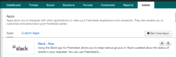
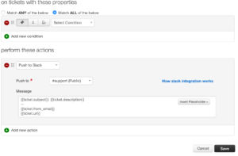
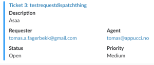
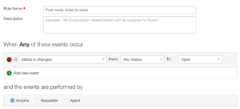
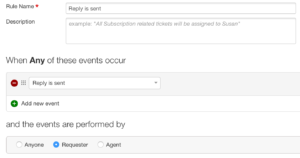
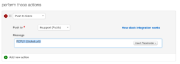

Adding slack as an app in Freshdesk allows you to use observers and dispatcher in freshdesk to notify / recieve data from Slack. **First, add Slack as an app to Freshdesk**

1.  Login to your Freshdesk
2.  Click Admin > Apps > Get more apps [](./Screen-Shot-2016-08-02-at-15.27.24.png)
3.  Search for slack
4.  Add it to your team and channel

#### **Add an dispatcher rule if you want notification when ticket is CREATED**

1.  Click Admin > Dispatcher > New Rule
2.  At the bottom, choose **Push to Slack**, and select your channel
3.  The Message need only be the

    ```
    NEW TICKET: {{ticket.url}}
    ```

[](./Screen-Shot-2016-08-02-at-15.31.05.png) Unfortunately, if you try to insert the comment made by the customer, you get the whole html, which is more of an annoyance than anything. Luckily, the ticket.url is picked up by slack, and you'll get basic information on the ticket :D [](./Screen-Shot-2016-08-02-at-16.10.56.png)

#### Add an observer rule if you want notification when ticket is UPDATED

1.  Click Admin > Observer > New Rule
2.  Trigger when e.g. a reply is sent [](./Screen-Shot-2016-08-02-at-15.25.44.png)
3.  You might want it to only trigger when the customer replies (not yourself) [](./Screen-Shot-2016-08-02-at-16.13.33.png)
4.  Then, post to Slack. Again, use the url of the ticket, and don't include reply text.

    ```
    REPLY: {{ticket.url}}
    ```

    [](./Screen-Shot-2016-08-02-at-16.15.34.png)

There you go. There's also possible to create tickets from slack, but that's not very useful for me, so I'll just refer to the [Freshdesk docs](https://support.freshdesk.com/support/solutions/articles/206103-the-slack-app) for that.
