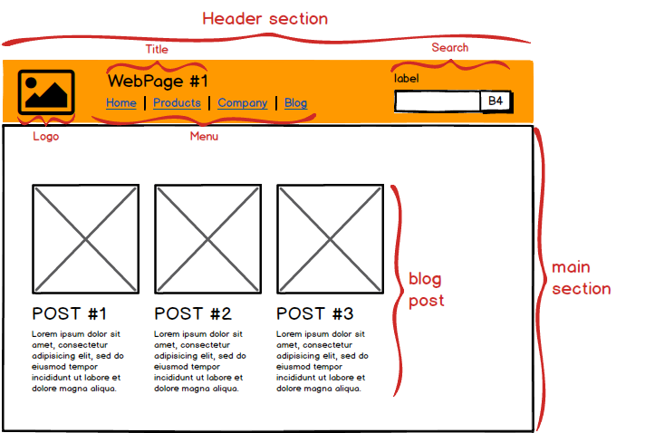

What's wrong with CSS? How do you write scalable CSS? What's the difference between [SMACSS](https://smacss.com/book/), [BEM](http://getbem.com/introduction/), [OOCSS](https://github.com/stubbornella/oocss/wiki), [SUIT CSS](http://suitcss.github.io/) and [Atomic Design](http://bradfrost.com/blog/post/atomic-web-design/)? Here's some _opinionated_ thoughts on the confusing world of CSS.

## **What's the problem with CSS? **

The cascading property, and one's initial though that it's a great idea, which in turn leads to the problem captured superbly by this joke:

> Two css properties walk into a bar. A barstool in a completely different bar falls over. [@thomasfuchs](https://twitter.com/thomasfuchs/status/493790680397803521)

You can take this further:

> Two CSS properies walks into a bar. A table at a different bar collapses, and causes
> rows of beer to flex. Drunk paragraphs to unalign from the grid and [@rachelandrew](https://twitter.com/rachelandrew) shouts at you for being dumb.

CSS will over time always unmanageable if not put in a system.

CSS properties in the traditional sense of _cascading_ style sheets, will too often be appended at the end of a huge CSS file with higher and higher specificity as a project gets older. The increasing level of specificity is added because the developer:

1. wants to avoid unintentionally affecting other elements.
2. wants to override any other css properties already affecting the given element.

These are both symptoms of not being sure what your own css is doing, and both will eventually [lead to a lot of junk css](http://mrmrs.io/writing/2016/03/24/scalable-css/).

## What's the solution?

Everyone seems to agree that it's related to putting the css in some sort of system. [SMACSS](https://smacss.com/book/), [BEM](http://getbem.com/introduction/), [OOCSS](https://github.com/stubbornella/oocss/wiki), [SUIT CSS](http://suitcss.github.io/) and [Atomic Design](http://bradfrost.com/blog/post/atomic-web-design/) are different attempts at that, and some of them might stick around. Let's compare!

### Concepts to know

Before we compare the systems, we need to learn about a few concepts and use the same vocabulary.

#### Semantic vs content-independent CSS

Say you have a search form in the top right corner of your website, that looks something like the picture below. What should be the class name of this component?  If you use semantic classes, you could name it something like "search" or even "header-search", because it is **how** it's used. If you use content-independent classes, you might call it "tiny-form",  because that's **what** it is. The CSS systems we'll look at are not explicitly in favour of one or the other, but some lean towards content-independence. // _I'm pro content-independent CSS, but that's a discussion for [another post.](http://notes.webutvikling.org/semantic-vs-content-independent-css/)_

#### Separation of container and content

[Separation of container and content](https://www.slideshare.net/stubbornella/object-oriented-css/23-SEPARATE_CONTAINER_AND_CONTENT) is about styling a component independent of where it is used. For example, don't style the search field above based on it being placed within the header. This keeps your design from becoming rigid and filled with dependencies. You can copy or move the search from the header of the page to the footer, without rewriting or adding any css. The common exception from this rule is in layout. You might want to position a component differently in the header and footer, so that's OK. This concept is advised in all CSS-systems we'll look at.

#### Separation of structure and skin

Imagine your web application with no borders, only Helvetica, and no colors. The CSS that remains, is called [structure-css](https://www.slideshare.net/stubbornella/object-oriented-css/32-SEPARATE_STRUCTURE_AND_SKIN). Skin-css are the colors, fonts, shadows and borders – the "feeling" of your application.

- **structure**: width, height, padding, positioning etc.
- **skin**: colors, shadows, borders, fonts etc.

The principle of using separate classes for specifying structure and skin is based on the idea that skins are often reused across many elements where structure cannot, and visa versa. It therefore allows for great reusability classes, and a swift change of appearance through changing a few skin-classes. This concept is advised in SMACSS and OOCSS. It doesn't fit neatly into BEM or SUIT CSS.

### Example site

OK, enough concepts. Before we dive into the different systems and compare them, let me quickly show you a dummy sketch for an imagined blog. We'll use this example and see how the individual CSS systems come up with their own concepts to talk about these elements, and show what syntax they would use to target the elements. 

### **Atomic Design**

I'd like to start with [Atomic Design](http://bradfrost.com/blog/post/atomic-web-design/), which is not ([Atomic CSS](https://acss.io/) nor) really a css system at all. So it sort of doesn't belong here? Yeah, not quite. It's really a system for designing applications, rather than structuring css, but it does give us some useful terms to describe the different components (and a mindset I like a lot). Also, the system can easily be adapted to a specific css convention, as I'll show. In atomic design,  the design is split into:

- **Atoms **are the smallest indivisible element: an html-element. In the example, the logo is a single image tag, so it's an atom.
- **Molecules **are groups of atoms that makes sense when placed together, e.g. search, which consists of the atoms search label + input + button.

- **Organisms **are molecules and/or atoms that are put together to form a meaningful group. E.g. the header section, which consists of a logo (atom), title (atom), menu list (molecule) and search (molecule).

- **Templates **are groups of organisms, i.e the whole example above.

- **(Pages) **are versions of templates filled with meaningful data, e.g. an actual image instead of a placeholder, an actual paragraph instead of lorem ipsum etc. It doesn't fit into our discussion of CSS systems, so I'll ignore it from now on.

Another concept which is not stated as clearly is [Style Modifiers](http://patternlab.io/docs/pattern-stylemodifier.html). These can be used for small variants of a components, such as [btn-primary vs btn-danger in bootstrap](http://getbootstrap.com/css/#buttons-options). I'll use these terms above in describing the other css systems

#### Example Atomic Design with BEM flavor

Below an example of how you **could use** Atomic Design for a css naming convention, with a bit of BEM inspiration.

```css
/* organism */
.o-header {
  width: 100%;
}

/* molecule */
.m-menu {
  width: 50%;
}

/* atoms */
.a-logo {
  width: 50px;
}
.a-menu__item {
  list-style: none;
}

/* atom modifier */
.a-menu__item--active {
  font-weight: 600;
}
```

### BEM

[BEM](http://getbem.com/introduction/) stands for Block Element Modifier, which are the three concepts used for naming css-classes. BEM not a framework or anything you download, but rather a naming convention.

- **Elements: **Within the menu there are list items. They **have no standalone meaning**, but are semantically tied to the menu-block. Same with the elements inside search. The label and button is here tied to the input, and together they make up a meaningful search component. Any HTML component that are dependent on others to give meaning, are called Elements**.**

- **Blocks:** Inside the header section, we have 1) a logo, 2) a title 3)  a menu with links, and 4) a search. These are four **semantically independent components**, independent of anything else to make sense. Any HTML components that are independent of all other HTML components are called Blocks.

- The Elements and Blocks can have **different versions (Modifier)**, such as the active menu-item.

#### Example BEM CSS

```css
/* blocks */
.header {
  width: 100%;
}
.menu {
  width: 50%;
}
.logo {
  width: 50px;
}

/* element */
.menu__item {
  list-style: none;
}

/* element with modifier */
.menu__item--active {
  font-weight: 600;
}
```

Comparing BEM to Atomic Design, we see that Atoms can be both Blocks and Elements. For instance, the logo is a Block, while the menu item is an Element. The concepts of Organism and Templates and chunked together, and are also just Blocks. The only thing the can be directly translated is Modifiers, which seems like the same thing. However, several argue that [BEM and Atomic Design can be best buddies](https://nordnet.design/an-atomic-workflow-for-design-development-at-nordnet-e91c815428b6), with a bit of tweaking.

The main principle here that has not been introduced in previous sections, is that a Block encapsulates the elements inside it. You should never reuse an Element directly, only through Blocks. This distinction is not made with In Atomic Design with Atoms (though can be introduced via a naming convention).

In short, BEM tells you to use 3 different categories of classes. It's quite simple to understand, it gives consistency (if you follow the [naming convention](http://getbem.com/naming/)), and prevents long specifiers since **it separates container and content.**  It's focused on the CSS, so it does not give much insight/thought towards the collaboration between developers and designers.

### OOCSS

[OOCSS](https://github.com/stubbornella/oocss/wiki) (Object-Oriented CSS) was maybe the first popular CSS system, introduced in 2009. It's not really a system to be adopted any more, but is more known for its two main principles, which were mentioned earlier:

- **Separate container and content**. For example, don't style a search field based on it being placed within the header. In the context of atomic design, a _molecule_ should never (or rarely) be styled on the basis of what _organism_ it is contained in. This allows you to easily reuse the molecule elsewhere, as it should look and act the same.
- **Separate structure and skin**. Use different classes for the `width`, `height`, `padding` (structure) than for `color`, `box-shadow`, `border` (skin). This is based on the idea that skins are often reused across many elements where structure cannot, and visa versa. It therefore allows for greater reusability.

#### Example Anti OOCSS

```css
.header .search {
  width: 16.666666666%;
  color: pink;
  background-color: green;
  border: 1px solid black;
}
```

#### Example OOCSS

```css
.main-theme-skin {
  color: pink;
  background-color: green;
  border: 1px solid black;
}

.col-md-2 {
  width: 16, 666666666%;
}
```

I wouldn't recommend using OOCSS today, but mention it here for its importance in being a base for the other systems to evolve from. [Atomic CSS](https://acss.io/) (again, not Atomic Design) went in one direction where class names are strictly tied to it's css properties. BEM in another, were structure and skin separations was dropped, while SMACCS created the Theme CSS group, where skin overrides default values. _Off-topic: I'm no fan of the name, as "Object-oriented" is a loaded term with various associations. A better name to convey that components are independent of their location within the page could be **PICSS **(Parent-Independent CSS). It sounds nice too, like pics. I'm not convinced about separating skin and structure, and it seems newer systems are divided on this as well. _

### SUIT CSS

While atomic design, oocss and BEM are more conventions and methods of structuring and/or naming css, [SUIT CSS](http://suitcss.github.io/) also includes build tools ([PostCSS](http://postcss.org/) ++) for normalizing, adding vendor prefixes, linting and adding variables. I'll focus only on its [naming convention](https://github.com/suitcss/suit/blob/master/doc/naming-conventions.md), which is similar BEM:

- blocks in BEM, are in suitcss called `ComponentName`

- elements in BEM, are in suitcss called `descendentName`, and includes block-/component name in the class name, i.e. `ComponentName-descendentName`

- modifiers in BEM, are only allowed on Components, not descendants, i.e. `ComponentName--modifier.` Note that suitcss also have a similar concept _state_, which difference from modifiers in that they can change after render (see below).

it also have a few extra categorizations of classes:

- **utiliity-classes**, e.g. `u-block` or `u-textBreak`
- **state-classes, **e.g. `is-disabled`

#### Example SUIT CSS

```css
/* Component */
.Header {
  width: 100%;
}
.Menu {
  width: 50%;
}
.Logo {
  width: 50px;
}

/* Descendant */
.MenuItem {
  list-style: none;
}

/* State */
.MenuItem.is-active {
  font-weight: 600;
}
```

The naming convention is (as you can see) very similar to BEM. The difference is that it splits modifiers in BEM into modifiers + state. The difference is that state can change after render, while modifiers can not. For example, the menu item can be active when you scroll to it, i.e. it's a state. A danger button is a button with a modifier, as it will never become a regular button after render. SUIT CSS does not focus much on reusability of the css classes, but it advertises itself towards component-based development, e.g. React. In that context, reusing classes are not that important. Why? Because a search input can be based on a tiny form component, which itself can be reused. I'm going to have to think more about that before I decide whether or not I like that. But it definitely seems like the mindset of SUIT CSS is more alike [scoped css](https://vue-loader.vuejs.org/en/features/scoped-css.html) (i.e. separate css pr component, which itself is reused) than OOCSS' mindset (i.e. reusability of css classes them selves).

### SMACSS

[SMACSS](https://smacss.com/) (Scalable and Modular Architecture for CSS) has five categories for categorising CSS rules:

- **Base rules**, are CSS rules applied to HTML-elements, based on their type (e.g. h1, a, body), not based on class names or IDs. This provides design for regular components, such as paragraphs and headers in a blog post, and a good starting point when designing a new component.

- **Layout rules, **are rules applied to the major sections of the site, such as a header (organisms). They decide in large part the positioning of elements, such as the header logo being placed in the left corner of the header, the search in the right, the max width of the application etc.

- **Module rules,** are rules applied to grouped elements, such as a header + picture + ingress for a specific blogpost  on the front page of a blog (molecules). Modules can have "subclasses", such as btn-small. Smacss makes a principle out of having modules that are independent of their *layout,* i.e. the oocss principle of separating container and content.

- **State rules, **are almost like state classes in SUIT CSS or modifiers in BEM. The difference is that it's called sub-module if it's a modifier that is persistent,  while state rules are expected to change. An example of a state-rule would be is-collapsed, while a danger-version of a button (given that it does not change after render) is not. Since state rules should override rules from other classes, !important is actually recommended here. I can see the point of that here, and don't mind.

- **Theme rules **are my favorite rules. The theme, or look and feel are determined in large part by fonts, font sizes, borders, background colors. What if there was no css in your other parts defining this theme feeling? You could create theme rules in its own file, sort of like base rules. Changing the theme rules alone could change a page from grunge to clean, while leaving the structure intact

#### Example SMACSS

```css
/* Base */
* {
  box-sizing: border-box;
}
h1 {
  font-size: 26px;
}

/* Layout */
.l-header {
  width: 100%;
}

/* Module rules */
.m-menu {
  width: 50%;
}
.m-logo {
  width: 50px;
}

/* Descendant */
.d-menu-item {
  list-style: none;
}

/* State rules */
.d-menu-item.is-active {
  font-weight: 600;
}

/* Theme */
.l-header {
  background-color: orange;
}
```

The more I think about it, the more I like smacss. It neatly maps to different concepts from other systems, and provides all the perks while mitigating most of my issues.

- **Atomic Design** gives a clean overview over the whole design, but it's not centered around css naming conventions, so it's not concrete enough to be used as that.SMACSS concepts give the clean overview and have concrete conventions!

- **BEM** is appealing, as it's simple, and encapsulates components as independent blocks. But can it can be awkward putting blocks on organisms, and using modifiers as both versions and states.SMACSS encapsulates with modules + descendants, and uses Layout for organisms, sub-modules for versions, and state rules for states. It makes sense using layout (+ module) specifiers in smacss to specify positioning, while the similar block (+ block) specifiers seems dirty in BEM.

- **OOCSS **is old and with a diffuse naming convention, but has an interesting principle of skin + structure separation, missing from many others.SMACSS feels modern and theme rules provides the ability for quick changes in theme/feel.

- **SUIT CSS **neatly separates state and versions, but are otherwise BEM with a less common casing, so it still misses a concept of layout.SMACSS has both state-version separation and the concept of layout.

Additionally, SMACSS got those fancy base-rules.

## Summary

CSS can be messy, and you should without doubt use a CSS system to combat this. It will promote consistency, simplify changes, and reduce your development time (by cutting the frustrating parts).Which system you choose to use doesn't matter that much, but I do recommend developers to read up on each and (for the fun of it, if nothing else), combine 2 or more into your own ultimate CSS-system.

There's other systems worth looking into, like [tachyons](http://tachyons.io/), which looks like a modular BEM-inspired bootstrap with a strong influence, and [Atomic CSS](https://acss.io/) which seems like inline css on steroids (consider only for component-based JS-frameworks – use with caution).

I guess it's not a secret that I currently lean towards SMACSS, but that might change sooner than my favorite JS-framework. I would also recommend reading [Atomic Design](http://atomicdesign.bradfrost.com/), in order to see beyond our own sphere and consider how we could collaborate with designers and engage stake holders.

I love the idea of creating a mini-bootstrap showcased in a living design guide, and consider this the ultimate delivery of Design+CSS work. This would do so much for reusability, consistency and communication.

---

- [styleModifiers]() can be found in [Pattern Lab](http://patternlab.io/), a develop/design tool sprung out of [Atomic Design](http://bradfrost.com/blog/post/atomic-web-design/)
