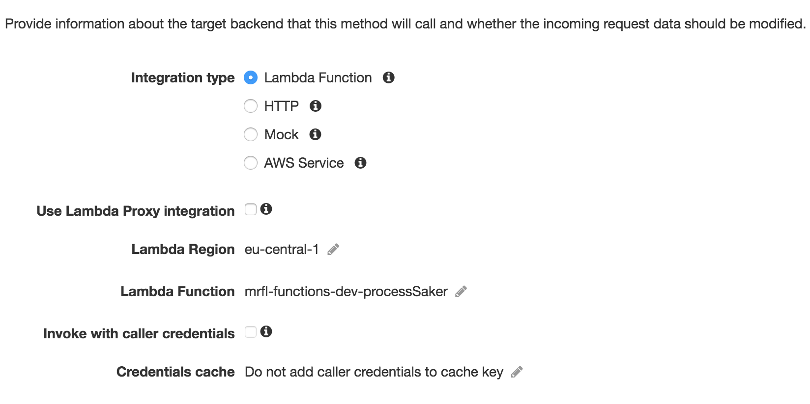
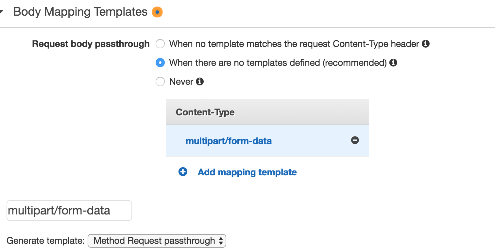
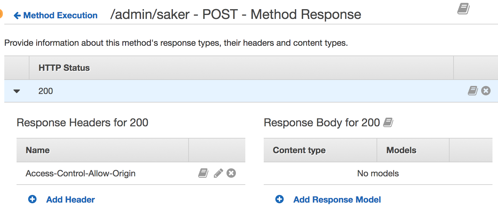

Create an AWS Lambda function with Python3 and integrate with S3? 
Simple when you know how – though getting there can be tricky.  

*Sidenote: I bet Amazon does this on purpose where they create a terrible UI as a way to 
*trick developers in on their certification-ride?*. 

I found how, copy-paste below. 

_Note: These are set up with [serverless](https://serverless.com/), which is an
 awesome tool. If you're a Cloudformation/Terraform-user, I bet you'll figure it 
 out from the .yml-file._ 
 
## Examples

#### Python Lambda hello world response 
https://gist.github.com/tomfa/22f2a1f7567377d6fbfcd5ce5106642d 
 
### Python Lambda write to S3
https://gist.github.com/tomfa/7bb519a34262353087a83712539eb6b0 

### Python Lambda accept file and save to S3

This one is more tricky! We can
[add an API-Gateway as an S3 proxy](http://docs.aws.amazon.com/apigateway/latest/developerguide/integrating-api-with-aws-services-s3.html)
, and fire a trigger lambda after the upload. That is probably also the advisable 
thing to do. If you persist in going in the wrong direction on this, you can 
end up solving it like this:

1.  Deploy this serverless: [https://gist.github.com/tomfa/87947d2773b60fc3797491d6ef5e3d0e](https://gist.github.com/tomfa/87947d2773b60fc3797491d6ef5e3d0e)
2.  Realize shits not working, and manually set API-Gateway endpoint to accept blobs (this annot be done in serverless):
    *   **First, remove "Use Lambda Proxy integration** 
    *   **Scroll down and accept multipart data, then Save** 
    *   **Navigate to Method Execution (on API Gateway endpoint) and allow HTTP 200 responses** _(what? this seems weird)_ 
