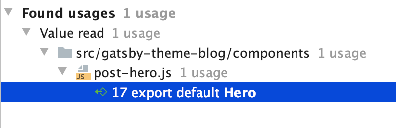
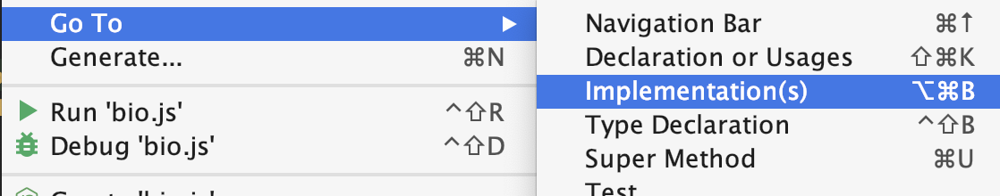
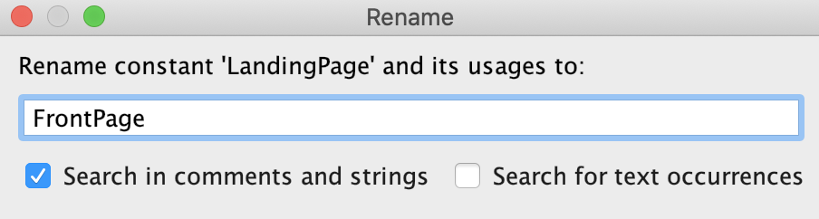

Unless you're making a library for others to consume, don't use default exports! 
Yes, they make the import line look better, and they come at obvious cost, 
but I'll show how it hinders refactoring and decrease your productivity.

_Disclaimer: This post is about default exports in your own project. When creating libraries for others to consume: a default export makes a lot of sense since it simplifies use. How is it different? IDEs don't autocomplete nearly as detailed (sensibly enough) when importing from libraries, and the consumer rarely cares (or know) about the inner function names of external libraries._

## The pros

Why do I use default exports?

### 1. No brackets on imports!

```js
import LandingPage from "./pages/LandingPage"

// instead of

import { LandingPage } from "./pages/LandingPage"
```

Nice syntax right? Even better, let me import and rename in one go:

### 2. Rename imports in one go!

```js
import FrontPage from "./pages/LandingPage"

// instead of

import { LandingPage as FrontPage } from "./pages/LandingPage"
```

Neat, huh? Well, you better love it, because that's where the pros end.

## The cons

### 1. Finding usages

**Find usage of class is broken.**

> Me: IDE, find me the usages of this class


> IDE: It's used in the default export of the class you're in



You might say: _"Well, I use grep, or search for it, so that doesn't affect me"_.
But you'd be wrong, because of the next con.

### 2. Searching for usages

**You can not reliably search for use of the class, due to (accidental or intentional) import renames.**

```js
// HomePage.js
const LandingPage = () => <div>Welcome</div>
export default LandingPage

// App.js
import HomePage from "./pages/HomePage"
return (
  <Wrapper>
    <HomePage />
  </Wrapper>
)
```

- Going to class "HomePage" would yield no results.
- Searching or greping for LandingPage would not yield any results from `App.js`.

You'd might argue that it's because LandingPage is in a file called `HomePage.js`,
and you would always name the file and the class similarly. But accidents happen.
And even if you were consistent, you wouldn't find the number of usages.

Also: navigation require an additional step as you would then have to search for
`FrontPage` within that file.

### 3. Navigating to implementation

**Going to implementation requires an additional step**

> Me: Please, let me see the implementation of this component



> IDE: I think it's declared up here in the import section of your current file.


Other IDE's might be a tad smarter, and send you to the export default line in
the referred file. But that's usually not quite where you want to go either.

### 4. Refactoring leads to inconsistencies.

**Even if you've been a really good boy (or girl), and been consistent with your
naming, refactoring requires one additional step per file where it's used.**

```js
// LandingPage.js
const LandingPage = () => <div>Welcome</div>
export default LandingPage

// App.js
import LandingPage from "./pages/LandingPage"
return (
  <Wrapper>
    <LandingPage />
  </Wrapper>
)
```

> Me: Please rename this class to FrontPage



> IDE: Done! Except for the default imports, because you've selected your name for those yourself.

Even if your IDE decides to rename default impors, you might have imported it as `LadningPage` once.

```js
// FrontPage.js
const FrontPage = () => <div>Welcome</div>
export default FrontPage

// App.js
import LandingPage from "./pages/FrontPage"
return (
  <Wrapper>
    <LandingPage />
  </Wrapper>
)
```

### 5. Code readability suffers

**Code becomes harder to read, since the same component is more often renamed on import**.

Why do we use default exports at all? Due to code readability _in the import statement_.
But that's never the place where we have problems understanding what happens. Modern
IDEs autoimport, and ESLint can automatically remove unused imports. I almost _never read the import statement_ anyway
Isn't it then ironic that it actually decreases code readability?

```js
return (
  <Wrapper>
    <LandingPage />
  </Wrapper>
)
```

This line above makes sense. But let's say `LandingPage` was refactored to
`FrontPage` a few months ago, and `App.js` import statements were forgot.
We have no references to, files or classes named LandingPage any more.

The now inconsistent naming adds mental overhead, and an additional step:
Figuring out what the crap `LandingPage` is.

## The end

I am thrilled to see support on this topic from [Nicholas C. Zakas, Eslint creator](https://humanwhocodes.com/blog/2019/01/stop-using-default-exports-javascript-module/).
Unlike him, however, I'm not just defending my own preference for named exports,
I'd like to convince you as well.
