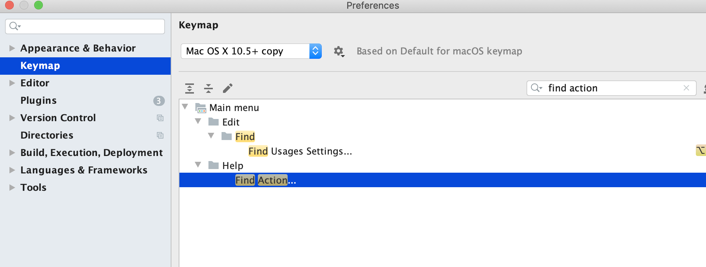

Do you know the feeling when you see your family drag their mouse
over some text to select it, right clicking to find the `Copy`
command, then right clicking again somewhere else to `Paste` it?
It's a bit painful right? I find myself sometimes thinking
"They don't _really_ know computers". And then I wonder if
that's what a experienced programmer might think when I
navigate the project files using my mouse.

**Challenge: for 1 day, do not use my mouse while in the editor.**

I can have 1 exception:

- Finding shortcut for searching the actions (I need shortcuts for).

In a IDE, everything I can click or do, is a `Command` (VSCode)
(or `Action` in WebStorm). Each of these actions can be tied
to a `Shortcut`, e.g. `ctrl+ c` to perform the `Copy` command.

The first shortcut I need to know is how to show all commands.


**VSCode:** Go to `Code` in the top left corner ->  `Preferences`
-> `Keyboard shortcuts` -> Search for `Show all commands`.
On my machine, that defaults to `cmd + shift + p`.



**WebStorm**: Go to `WebStorm` -> `Preferences`. Search for
`Find action`. On my machine, that defaults to `cmd + shift + a`.

_If the command already have a default shortcut, I generally
try to keep it. That way, it's easier to use the programs
on other machines, and let others use it on my machine._

### Setting up shortcuts

Now that I have a shortcut for finding commands, I can use this
to do anything. Here I copy and paste by using it (!).

- Select some text (hold shift and use the arrows).
- Open the command window (using the shortcut).
- Search for `Copy` and select it (using arrows and Enter)
- Navigate to start of line (using cmd/ctrl + left arrow)
- Search for `Paste` and select it (using arrows and Enter)

Tada! Now I can do everything with my keyboard! However, that
wasn't very efficient. Using `ctrl + c` and `ctrl + v` would've
saved me a lot of time. Same goes with all the other commands
you typically use. So let's see how we can set up shortcuts:

- Open command window (`cmd + shift + p`)
- Search for and open `Preferences: Open Keyboard Shortcuts`
- Search for and select `Go to definiion`
- Add a hotkey, e.g. `cmd + shift + k`.

Great. Now find a file that where a class is _used_, e.g.
`<Header />` in the code below. While having the cursor on
`Header`, click `cmd + shift + k` and get teleported to the
definition!

```jsx
// Header.js
export const Header => <h1>Where am I?</h1>

// HomePage.js
const HomePage = () => <div><Header /><div>
```

Cool! Now, you might want to get back to HomePage after
having edited or just looked at Header. So go ahead and
add a new shortcut for the command `Go Back`. You know how!

After adding it, test it. You'll jump back to the HomePage!
This, along with `Go Forward`, is some of my very favorite
shortcuts.

### Which shortcuts to add/use

My general approach is to add shortcuts for commands as
I realize I need them. The difficult part has often been
finding the name for the command I want.

E.g. I might try searching for `Previous` instead of `Back`,
which is related to search instead of navigation. It can be
a bit of a hassle. I'm not always in the mood for spending
10 minutes identifying what I want is called `Go Back`.
Even though I know it's probably worth it in the long run,
I think "today is not the day". But I try my best to make
that the exception rather than the rule.

### VSCode shortcut cheatsheet

Here's a list of my favorite commands, and their shortcuts.
I'd recommend you to adopt one or two shortcuts at a time,
and start with the ones you use the most. Maybe more
importantly than shortcuts is efficient text navigation (below).

Finding good IDE commands is a journey of discovery, so if you've
discovered some nice commands, I would love to hear them:

<a href="mailto:tomas.a.fagerbekk@gmail.com">Send me an email</a>, or <a href="https://twitter.com/tommfa">
  @tomfa on Twitter
</a>!

## Mac shortcuts

This should be a separate post that I link to

- Open Alfred
- Circle through windows within application

## Chrome shortcuts

This should be a separate post that I link to

- Vimiumize -> ignore certain urls: Trello, Gmail,

## Editor shortcuts

- Select next word: `cmd + d`
- Select all of same in file: `cmd + shift + l`
- Navigate Back
- Navigate Forward
- Go to Declaration
- Find usages
- Navigate to File `cmd + p`
- Navigate to Symbol: `cmd + shift + s`
- Go to line: `ctrl + g`
- Reveal active file in side bar: `cmd + t` (?)
- Add file: `cmd + n` (?)
- Shift focus to Explorer: `cmd + 0`
- Shift focus to file (from explorer): `cmd + 1`
- Rename file
- Rename Symbol

## Shell aliases

```bash
alias ga="git add"
alias gc="git commit"
alias gco="git checkout"
alias gl="git pull --rebase"
alias ya="yarn add"
alias yad="yarn add -D"

# Add staged to last commit
alias gca!="git commit -v --no-edit --amend"

# Add all changes to last commit
alias gcan!="git commit -v -a --no-edit --amend"
```

## Basic shortcuts

- Go to beginning/end of line: `cmd + arrow`
- End of start/end of word: `alt + arrow`
- Cut line: `cmd + x` 0

## Custom shortcuts

I also like adding some shortcuts for typical commands, that are often specific for each project.

- Run all tests
- Run tests in the current file

## Efficiency helpers

This should be a separate post that I link to

- html autotab-complete
- imr -> Import React
- Auto import
- Auto format on save
