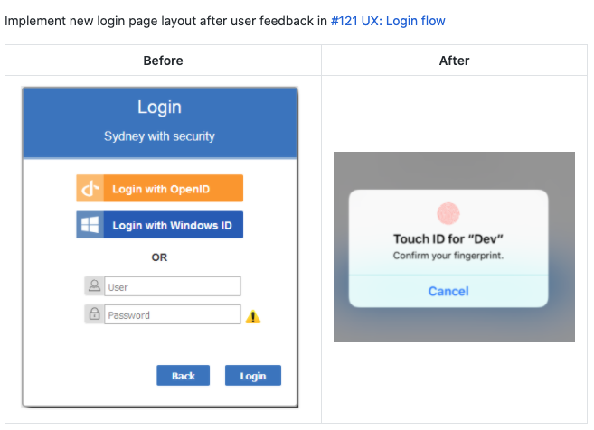
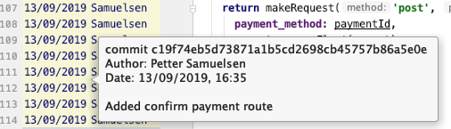
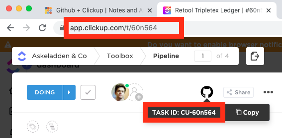
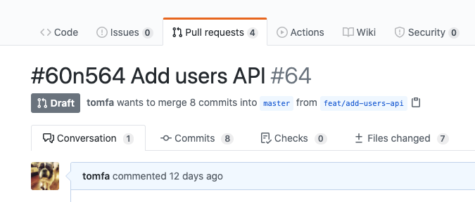
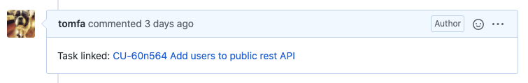

A small guide on how to use ClickUps integration with Github. 
But first, let's do three quick questions:

<details>
<summary>Why do I write Pull request texts? </summary>
 
<strong>So team mates can understand what I try to accomplish, and why.</strong>

A good text saves them time by giving them an overview and justification quick.
It probably saves me time too – since there will be less questions. 

Bonus: It might come in handy next time you'll need to do something similar
(or exactly the same for a different project).



</details>

<details>
<summary>Why do I write git commit texts?</summary>

<strong>So team mates (and my future self) can understand what I tried to accomplish.</strong>

A good text saves the future team time: the question *Why would you X?* can be answered quickly.



</details>

<details>
<summary>Why do we track issues in an Issue tracker?</summary>

<strong>So the team can discuss what we try to accomplish.</strong>

Why we should do them, what should we do first, or any justification for non-obvious choices. 
An issue tracker can simplify communication between the team, by making it async, and having a record of it.
</details>


#### Similarities:

Both commit messages, pull request texts and issue trackers info are more or less talking about the same things:

- What they want to accomplish
- What justification there might be for doing this
- What some concerns might be and how to fix them.

They're not identical, but they're definitely super useful to each other: 
PRs are easier when you can read the commit messages. Similarily, they're easier when you can read the issue tracker.

So I like referencing my issue in the issue tracker from my git commits, or/and PRs. 
It's a super quick and efficient way to provide useful context.

## Referencing the issue



The ID can be found via URL or with the Github icon in Clickup. 
In can be referenced from a commit, a branch name or a pull request title by adding
`#60n564`

### In the commit
```
#60n564 API: Added GET method for /users/ 
```

The upside of referencing the issue in each commit is that any future git blame
leads quickly to the issue tracker. 

If you have tried committing with `#`, you have probably noticed
that it is the default commment character in git.

You can change this character with the following command:

```bash
git config --global core.commentchar ";"
```

### As a branch
If you prefer not having it in the commit, you could add the issue number anywhere in the branch name.

```
git checkout -b feat/#60n564/api-add-users
```

### In the PR title

If you've forgot to reference the issue in the branch or commit messages, it's not too late. 
Just prepend it to your Pull request title.



## Auto-linking 

Clickup will automatically update the pull request and the ticket in ClickUp
when you do this. It *might take 10+ minutes*, but the Github PR will get a
comment from you (by ClickUp):



It will also add a reference to the PR from the ClickUp ticket:


