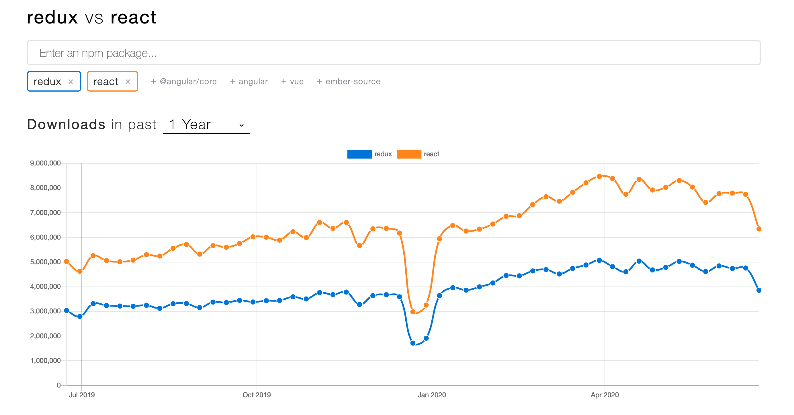
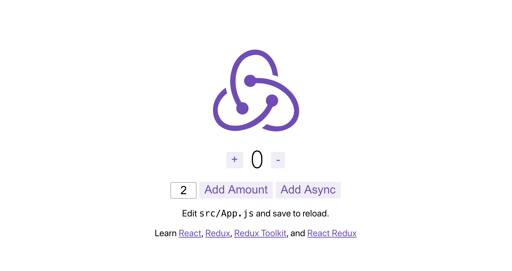
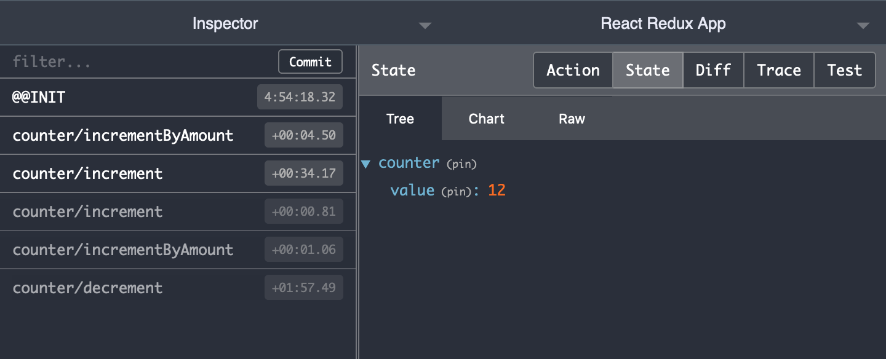

Going from `mapStateToProps` and `mapStateToDispatch` to `useDispatch, useSelector` or custom hooks: What's the benefits? Does typing inference work?

---

_This post is a step-by-step description of how I tested and came to the conclusions.
The code below exists at [github.com/tomfa/redux-hooks/](https://github.com/tomfa/redux-hooks/), and I'll be referencing commits as I go along._

Warning: Post is long. There is a **TLDR at the bottom**.

## First: How is Redux doing?



Good, its NPM downloads has increased about 50% the last 12 months, same rate as React. So it seems safe to use: Reacts useContext and useReducer hooks, nor `apollo-client` have made redux obsolete.

## Plan

1. Set up a React Redux with Typescript

2. Implement some redux state, and implement UI using _MapStateToProps_ and _MapDispatchToProps_. (_MapXToProps from now on._)

3. Swap to using hooks.

### Part I: Set up React Redux with Typescript

#### Install react with redux

```bash
npx create-react-app redux-hooks --template redux
```

And then run it:

```bash
yarn start
```



_Sweet. The browser should show you something ala the above_

#### Add typescript

Add types and the compiler ([666f61](https://github.com/tomfa/redux-hooks/commit/666f6123f54b938525839cc703deeb1496ffd4b2))

```bash
yarn add -D \
  typescript \
  @types/node \
  @types/react \
  @types/react-dom \
  @types/jest \
  @types/react-redux
```

And rename all `.js(x)` to `.ts(x)` files ([54bfd7](https://github.com/tomfa/redux-hooks/commit/54bfd7835589f47cf13aae12f87bf6bb55df6fc4)). You could do this manually (there's only ~10 files), or with the bash snippet here:

```bash
for x in $(find ./src -name \*.js); do
  mv $x $(echo "$x" | sed 's/\.js$/.ts/')
done
for x in $(find ./src -name \*.tsx); do
  mv $x $(echo "$x" | sed 's/\.tsx$/.jsx/')
done

```

Ok, sweet. Let's add a `tsconfig.json` with e.g. the following contents ([8b76f82](https://github.com/tomfa/redux-hooks/commit/8b76f82fd98830a99fadd2689164679e464a60eb)):

```json
{
  "compilerOptions": {
    "target": "es5",
    "lib": ["dom", "dom.iterable", "esnext"],
    "allowJs": true,
    "skipLibCheck": true,
    "esModuleInterop": true,
    "allowSyntheticDefaultImports": true,
    "strict": true,
    "forceConsistentCasingInFileNames": true,
    "module": "esnext",
    "moduleResolution": "node",
    "resolveJsonModule": true,
    "isolatedModules": true,
    "noEmit": true,
    "jsx": "react"
  },
  "include": ["src"]
}
```

_This config above is from [react-starter --template typescript](https://create-react-app.dev/docs/getting-started#creating-a-typescript-app):_

#### General hygenic setup

- Add prettier on commit – [9bd3b32](https://github.com/tomfa/redux-hooks/commit/9bd3b32)
- Run TS check on commit – [c490d79](https://github.com/tomfa/redux-hooks/commit/c490d792eebf72c18d80d0b552fcb692dd844461)
- Add missing types - [0e3a149](https://github.com/tomfa/redux-hooks/commit/0e3a149)

#### Get the Redux browser extension

Get the browser extension ([Chrome](https://chrome.google.com/webstore/detail/redux-devtools/lmhkpmbekcpmknklioeibfkpmmfibljd), [Firefox](https://addons.mozilla.org/en-US/firefox/addon/reduxdevtools/)) for [Redux dev tools](http://extension.remotedev.io/). It's incredibly useful.



_Click around and see how the log responds to your different clicks. Note how you can inspect the state, the action, the diff and export a test case (among other cool things)._

### Part II: Add some state

I decided to copy paste the state example from the [redux.js recipe: Usage with TypeScript](https://redux.js.org/recipes/usage-with-typescript/).

The app is a simple Chat app, where it consists of two main UI components:

- `ChatInput`
- `ChatHistory`

Some changes were made to the example code base, primarily to have self contained components without props that were using mapStateToProps and mapDispatchToProps. Below is the `ChatInputComponent.tsx`.

_The connected components can be viewed in the diff [e877b50...6efc2a2](https://github.com/tomfa/redux-hooks/compare/e877b50...6efc2a2)._

```tsx
import React from 'react';
import { RootState } from '../../store';
import { Dispatch } from 'redux';
import { connect } from 'react-redux';

import { sendMessage, updateMessage } from '../../store/chat/actions';
import './ChatInput.css';

interface OwnProps {}
type DispatchProps = ReturnType<typeof mapDispatchToProps>;
type StateProps = ReturnType<typeof mapStateToProps>;
type Props = DispatchProps & StateProps & OwnProps;

const ChatInterface: React.FC<Props> = ({
  user,
  message,
  updateMessage,
  send,
}) => {
  const onChange = (event: React.SyntheticEvent<{ value: string }>) => {
    updateMessage(event.currentTarget.value);
  };

  function keyPress(e: React.KeyboardEvent<any>) {
    if (e.key === 'Enter') {
      send({ message, user });
    }
  }

  function buttonClick(e: React.MouseEvent<any>) {
    send({ message, user });
  }

  return (
    <div className="chat-interface">
      <h3>User: {user} </h3>
      <input
        value={message}
        onChange={onChange}
        onKeyPress={keyPress}
        className="chat-input"
        placeholder="Type a message..."
      />
      <button onClick={buttonClick}>Send</button>
    </div>
  );
};

const mapDispatchToProps = (dispatch: Dispatch) => ({
  send: ({ message, user }: { message: string; user: string }) =>
    message &&
    dispatch(
      sendMessage({
        message,
        user,
        timestamp: new Date().getTime(),
      })
    ),
  updateMessage: (message: string) => dispatch(updateMessage(message)),
});

const mapStateToProps = (state: RootState, ownProps: OwnProps) => ({
  user: state.system.userName,
  message: state.chat.messageInput,
});

export default connect<StateProps, DispatchProps, OwnProps, RootState>(
  mapStateToProps,
  mapDispatchToProps
)(ChatInterface);
```

_I decided to keep the UI logic (mapping events to data) within the component. I believe this gives a fairer comparison, as it is not related to state._

#### With regards to types: this works great!

- **Automatic type inference** with these lines of boilerplate (in each connected component):

```tsx
// ../ChatInput.tsx
interface OwnProps {}
type DispatchProps = ReturnType<typeof mapDispatchToProps>;
type StateProps = ReturnType<typeof mapStateToProps>;
type Props = DispatchProps & StateProps & OwnProps;
```

- **Automatic store type inference** with this little snippet

```tsx
// ../store/index.ts
export type RootState = ReturnType<typeof rootReducer>;
```

TypeScript tells me if my store value has the wrong type when added to JSX, and also when passing the wrong input type into action payloads. It's good!

_It seems I have to explicitly type my action return types, which seems a bit redundant, but it's nevertheless a part that is unrelated to hooks or not, so I'll ignore that._

### Part III: Converting to hooks

#### ChatHistory: replace with hooks

_Diff: [1310a50](https://github.com/tomfa/redux-hooks/commit/1310a50)_

ChatHistory only used State. I feel the readability of the code is better, and it's also shorter, going **from 29 to 21 lines**.

_Sidenote in case you come across it too: I believed for a second that we rendered twice instead of once when doing the swap, but [that's a debug-feature](https://github.com/facebook/react/issues/15074)._

#### ChatInput: replace with hooks

_Diff: [988ee06](https://github.com/tomfa/redux-hooks/commit/988ee06)_

ChatInput went from 70 to 57 lines, with a total **codediff of -13 lines** (being the only changed file). I still decided to keep the UI-related logic outside of hooks, so the difference isn't as large as it could be.

Again, I think the diff makes the component read better as there is less boilerplate code, ala

```tsx
interface OwnProps {}
type DispatchProps = ReturnType<typeof mapDispatchToProps>;
type StateProps = ReturnType<typeof mapStateToProps>;
type Props = DispatchProps & StateProps & OwnProps;
```

Even without this typing-related code, the inference is intact.

#### ChatInput: replace hooks with custom hooks

_Diff: [1c5d82f](https://github.com/tomfa/redux-hooks/commit/1c5d82f)_

ChatInput goes from 57 to 34 lines, but since we're adding two new _hooks_ files, we end up with a **+14 code line change**. With custom hooks, we can rename things as we please, and all we end up with (relating to redux) is:

```tsx
const { inputValue, setInputValue, submit } = useChatInput();
const { userName } = useAuth();
```

It does require us to add (and maintain) extra "hooks files", but I think it reads _very easily_.

The separation of concerns are clear, with clean ability to reuse logic across components. Though this commit is some extra lines of code, it could become fewer if the hooks are reused; even just once.

### Summary

The overall change from MapXToProps to using **built-in hooks** can be seen in the diff [c22c184...988ee06](https://github.com/tomfa/redux-hooks/compare/c22c184...988ee06)

The change from MapToProps to using **custom hooks** can be seen in the diff [1310a50...1c5d82f](https://github.com/tomfa/redux-hooks/compare/1310a50...1c5d82f)

- Type checking was preserved throughout the changes.

- Code size decreased when changing to built-in hooks.

- Code size was equal when changing to custom hooks.

- Component with hooks [will rerender when parent rerenders, unlike with MapXToProps](https://react-redux.js.org/api/hooks#performance). However, this can easily be fixed with `React.useMemo` wrapping the component.

Overall, I do not see good reasons to keep using MapXToProps. Hooks seem more consise and readable.
