There's system logs and there's application logs.

System logs are quite similar across different services. HTTP servers typically include info about the request and the response,
such as timestamps, response times, urls, http methods, status codes. Services such as Heroku will often autogenerate these for you
– allowing you little or no control over them yourself.

Application logs are created by you in your app, and differ between applications. The simplest are just a message string,
which can be useful itself for debugging. You can structure the logs too, e.g. as JSON logging. In these you can add data such as
userId, the related url path, a request ID or what ever you find useful. Application logs can be used to identify errors or aggregate
business metrics such as number of sales or payment option selection.

The purpose of this post is to make use of Heroku system logs with [Kibana](https://www.elastic.co/kibana), through the use of [logz.io](https://logz.io/),
and find which metrics we want to include in our dashboard.

## Purpose of a dashboard

In my mind, a dashboard is suppose to give _someone_ an overview at a glance, that lets them prioritize.
A dashboard should not include "everything" – more than ~5 metrics or graphs easily becomes too much
information that we quickly learn to ignore, or don't know how to react to. Hence it makes sense to create different dashboards
for different teams.

I think of dashboards as belonging to one of three categories, each answering their own variant of the question "What's up?".

#### Motivational dashboard: How are we progressing?
A motivational dashboard is ment to give feedback on how you're progressing on the metrics you're caring about (this year/quarter/month).
This is usually not based on system logs, though it could be.

_Example metric: Successful signup ratio, displayed as a timeline over the last 3 months._

#### High level dashboard: Is everything OK?
A high level dashboard can tell you if something is wrong, or out of the ordinary.

_Example metric: HTTP status 400+ as a percentage of total requests, displayed over the last 1-2 weeks._

#### Detail dashboard: Where is something not OK?
A low level dashboard can let you narrow your search for the causes of something being "wrong".

_Example: List of URLs taking over 1000ms to respond, sorted by request counts over the last 1-2 weeks._


## Suggested metrics

Here's a few metrics from system logs that is useful in most API systems, and can be a starting point for a high level and a detailed system dashboard.

### High level: Response times and traffic

If an eye isn't put on performance, it'll often deteriorate as new features and libraries are added.
We want to identify which URLs are both commonly used and slow, so we can target our efforts in improving performance to where it matters.

- A list of the slowest URLs: their count (amount of requests), their median (50th percentile) response time, 90th percentile and 98th percentile.
- A line chart showing the amount of requests, our response times (50th, 90th, 98th percentile) across all paths

_Which percentiles to choose depends on the nature of your system, but the three above is a good place to start._


### High level: HTTP status >= 400

Having many metrics to pay attention to, can lower the engagement with a dashboard.
If there's "usually something wrong" and you don't react to it, the dashboard looses its value.
Similarily if you have a lot of metrics – it can become too much and we become blind to them.

In an overview dashboard, you can skip 400, 404 and 500, and just show the percentage of requests that are "bad",
i.e. HTTP status 400 and above. When that number becomes large, a developer can then dive deeper into the numbers to identify
what kind of 400+ status codes is happening, and where it


### Detail: HTTP status 500

HTTP status 500 means we have an bug in our code, or not handled edge cases in our API.
We want to identify at what urls people get 500 errors, and fix these bugs.

- A list that shows which paths are most common to give 500, lets us find what endpoints we should investigate first.
- A line chart showing the amount of 500 errors over the last 2 weeks can tells us if something is going terribly wrong today.

### Detail: HTTP status 404

HTTP status 404 means someone requested an URL that isn't there.
This can happen if we remove an endpoint that is still depended on, or a link or url has been mistyped in text or in application code.
We'll want to identify the sources of these requests, and fix them.

- A list that shows which paths are most common to give 404, lets us identify dead urls.
- A line chart showing the amount of 404 errors over the last 2 weeks can tells us if something has recently changed for the worse.

### Detail: HTTP status 400

HTTP status 400 means someone has requested or passed data that doesn't conform to API specifications.
This can be an API that changed, without the consumer application being updated.
We want to identify these URLs, the consuming application and fix them.


## Setting it up in Logz.io

### Adding a Logz.io log drain (Heroku)

All Heroku apps have the ability to have [their logs](https://devcenter.heroku.com/articles/logging) connected to your
[log drain](https://devcenter.heroku.com/articles/log-drains). We use this to send our Heroku system and application logs to Logz.io with the following command

```bash
heroku drains:add "https://listener-uk.logz.io:8081?token=myLogzToken&appName=my-heroku-application" -a my-heroku-application
```

_You'll need [Heroku CLI](https://devcenter.heroku.com/articles/heroku-cli) to run the command above, along with a [token from your Logz.io account](https://docs.logz.io/shipping/log-sources/heroku.html)_

After this has been set up, logz will start pouring into Logz.io.

#### Adding logs (NodeJS)

If you don't use Heroku, logz.io has a ton of [log integrations](https://app-uk.logz.io/#/dashboard/send-your-data/log-sources) with good documention. A popular option for my crowd would be the [NodeJS logger](https://app-uk.logz.io/#/dashboard/send-your-data/log-sources/nodejs).

_They even included info regarding Serverless environments in the Node setup ❤_

### Mapping fields

When your Heroku system logs starts coming in, click on them to expand and see their details.
You can notice a couple of things.

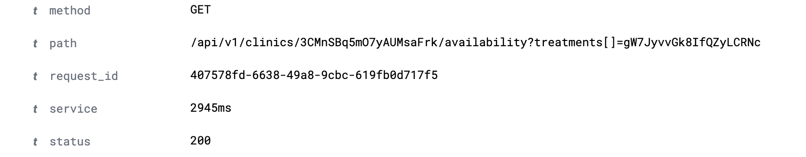

"service" and "status" are interpreted as text. This is a problem when we want to aggregate and filter on them.
In order to fix this, we'll actually have to contact support. Show them your logs, and ask them to remove "ms" on the service field.

_Sidenote: Logz.io has amazing support_

After "ms" is removed, you can change the type of status and service to integers.

Do this by going to Kibana -> Setting -> Index patters.

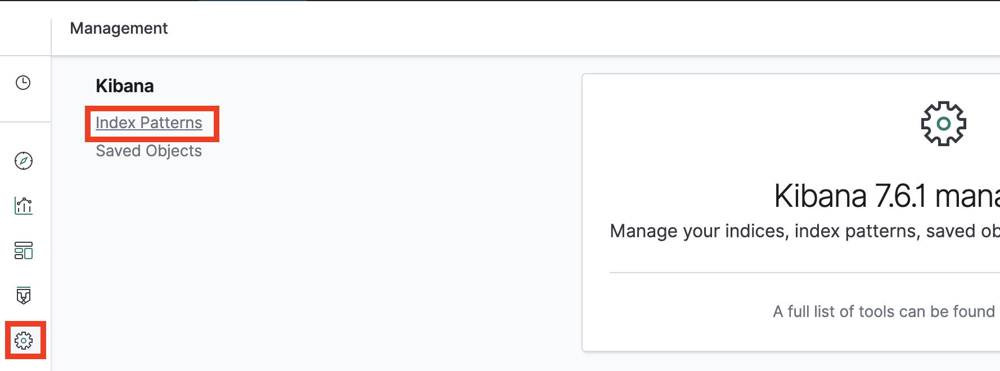

Then, search for status, edit it and change its type to integer

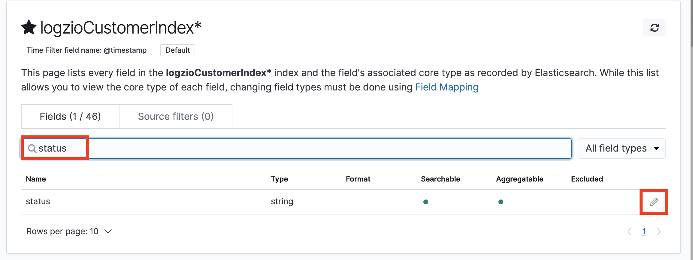

Great! While you're at it, you can consider the same to your application log fields.

_The need for mapping is minimized in your application logs if you use JSON logging with appropriate types._

### Have a tea break

Before creating any charts, we must let our application generate som logs that we can use. Meanwhile: have a well deserved tea break (coffee is ok too 💚)

### Creating dashboard: API response times

Setting up a dashboard is done in three steps, which maps to the icons in the left menu:

1. Discover relevant log data
2. Visualize a graph
3. Add graph to a dashboard

#### 1. Discover logs with "service" field

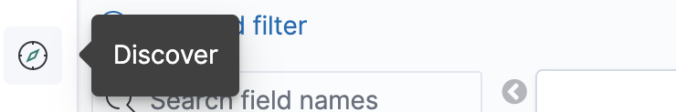

The "service" field is the Heroku variable tellings us how many millisecond a HTTP request took to complete.
We filter our logs to only show logs where this exists.

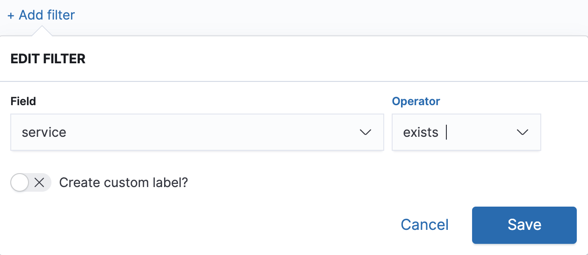

Then save it as e.g. "HTTP requests"

#### 2. Visualize HTTP request response times


Go to "Visualize" in the left menu, add a new "Line chart", and select the "HTTP requests" that we just created.

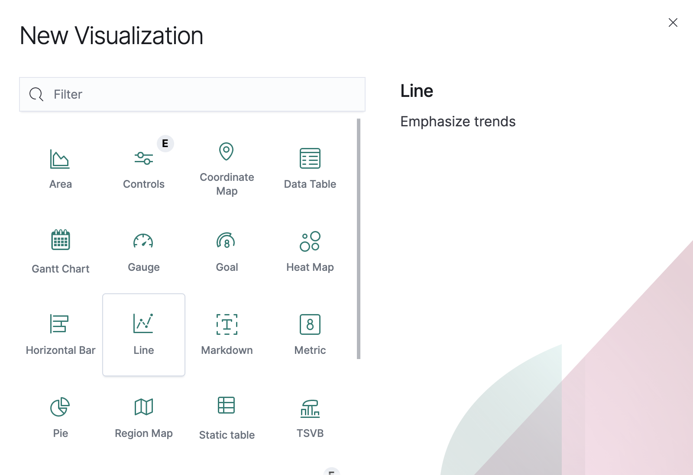

We now have an empty chart. Great!

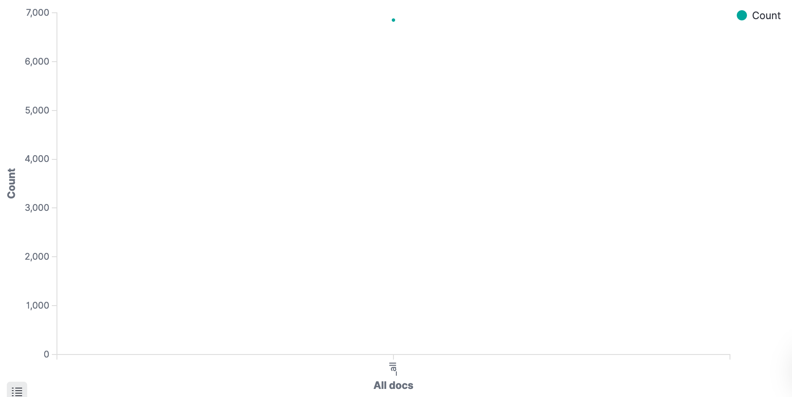

On the left side under "buckets", Add "X-axis". Select "Dato Histogram", which should autoselect our "@timestamp" field.

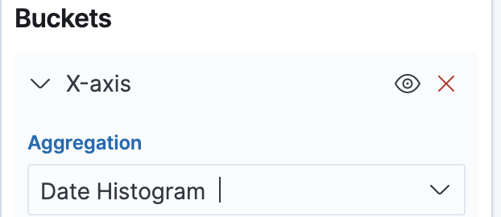

Click play. We now have a chart showing the amount of request! 🤩

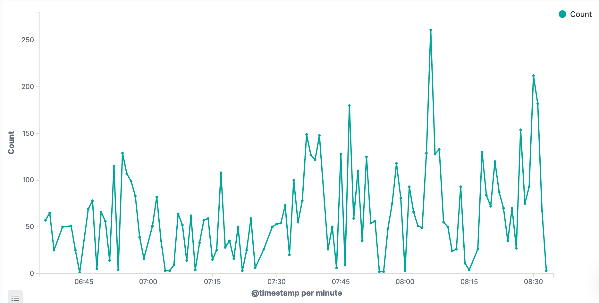

- Save that visualization as "HTTP traffic".
- Then Save it again, as a new visualization named "HTTP response times"

To replace the traffic with response times, replace Y-axis: count with the following:

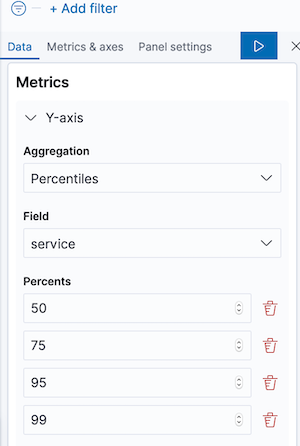

We've now got a graph, showing aggregated response times for our application. Yay! 🎉

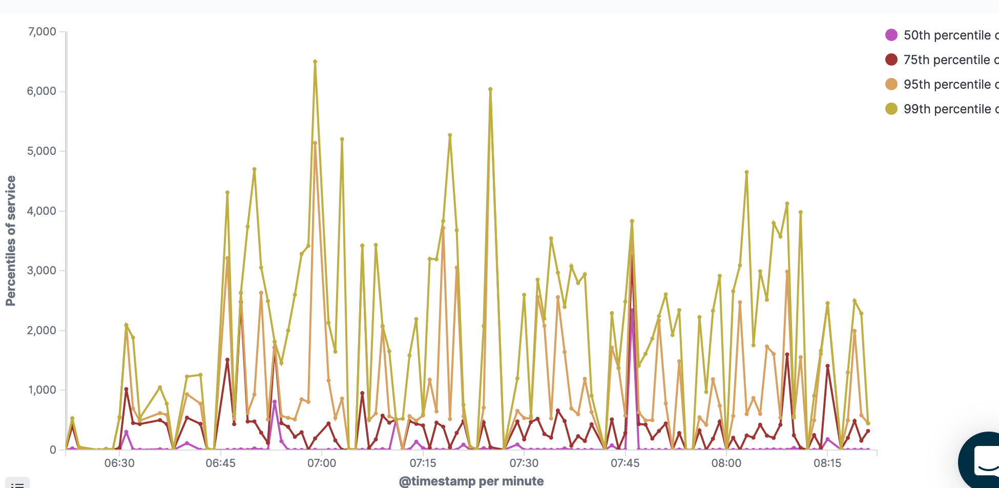

In your case, the graph might be empty, or (if you zoom in on time in the top right corner), very spiky – like mine.

Mine is very spiky because I zoom in on a small period with very little data. Little data means huge deviations.
Don't worry though – After you let it run for a day or two, we get more meaningful graphs.

### Dashboard

Go to the dashboard from the left hand side. Add an existing visualization, and select the "HTTP response times" we just created.

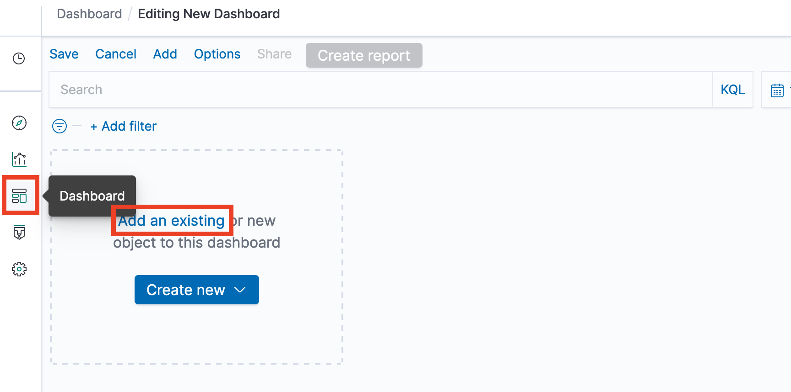

Repeat it again for the "HTTP traffic". We now got a simple performance dashboard! 😲

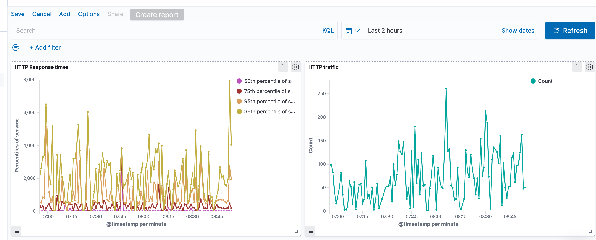

But it's hard to see if our performance changes are due to increased traffic load or not.
It would be nice if the traffic could include a response time indication in the same graph.

Click the cogwheel for the HTTP traffic visualization, and Edit it.

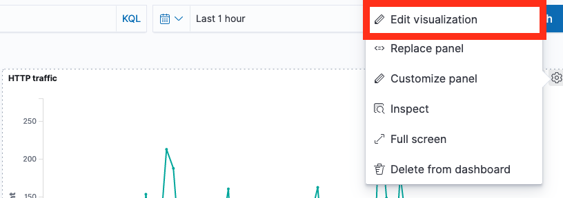

On the left hand side, add a Y axis with mediuan aggregation on the service field.

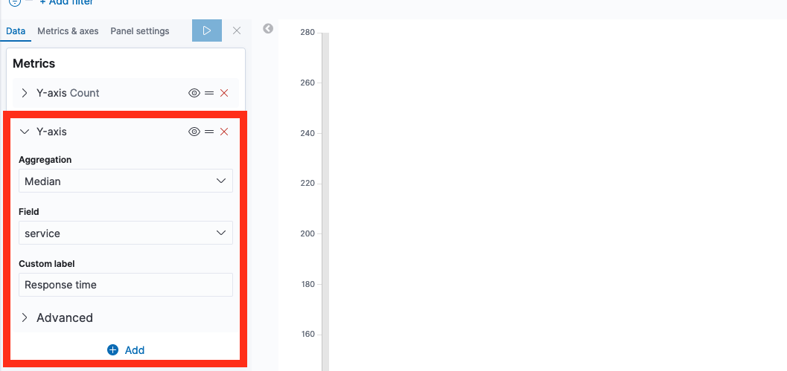

If you click Play now, the response times and counts are graphed on the same value axis. Usually, the response time graph is now so small it's completely useless.
We fix this by using left and right value axis.

Click the Metrics & Axes, select "response times" and change the value axis.


Done! The graph shows both traffic count (left axis) and median response time (right axis)
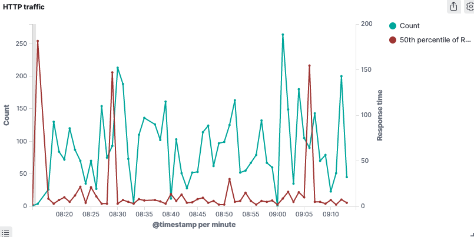

If you go back to the performance dashboard, it's now complete! 🎀


### Creating visualization: HTTP errors

Let's create a visualization for different types of error HTTP status.

Go to visualizations, select our "HTTP requests" data source.

Again, select the Bucket X-axis to be a Date historgram based on timestamp


Now filter based on status being above 400 – we don't care about successful requets here.

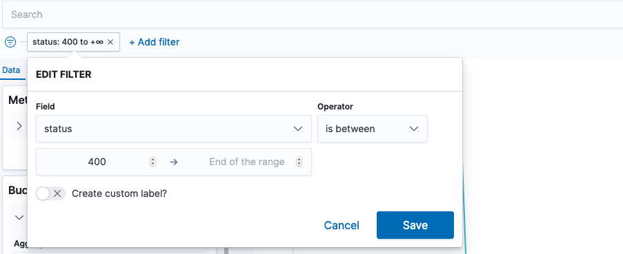

Under Buckets, add a "Split series" sub bucket.

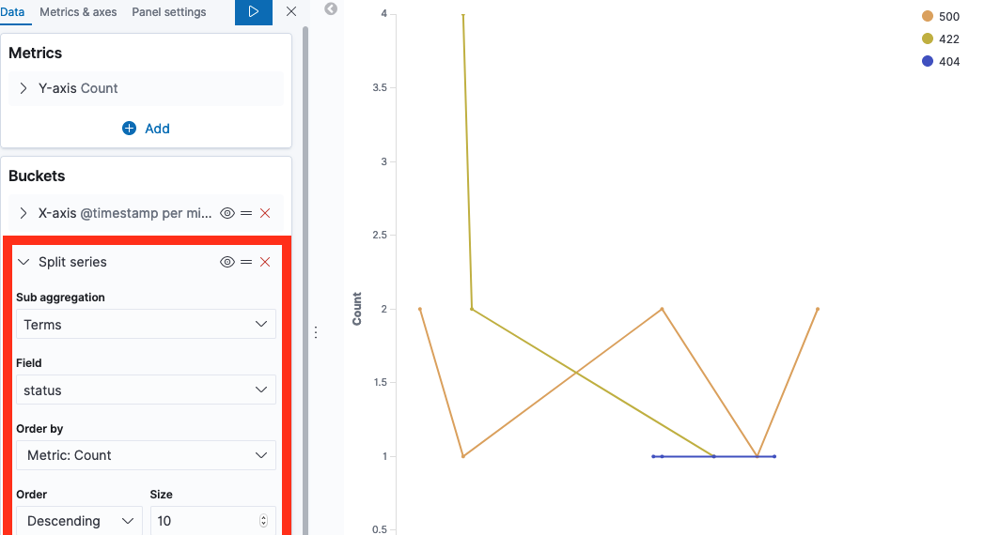

Click play, and your visualization is done. Add it to your dashboard 📈

_As with other visualizations, note that it may look useless until you have a few days worth of logs._


### Detail data: Identifying slow URLS

Add a new visualization, this time of the type Data Table.

We'll select the "HTTP requests" data source, and get a simple row with 1 value "Count". This is the number of requests.

Let's split the rows by its url, by adding a "Split rows" bucket, ordering them by slow response times.

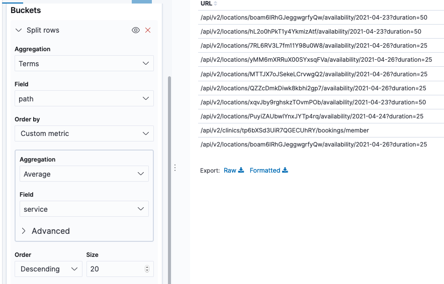

We now got a table showing us the most requested urls.

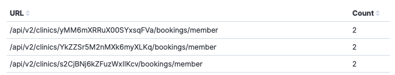

Now we can add a new metric, for the percentiles of response times.
Add a metric on the left side for Percentieles aggregation of "service" field, on 50, 90 and 98 percents.

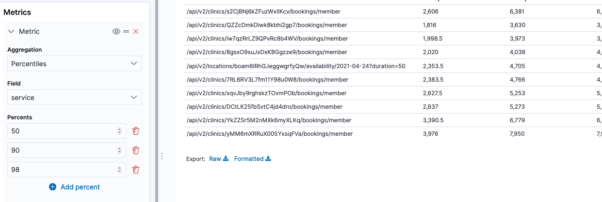

Voilla, we got ourselves a table of slow urls. A great place to start if our performance is bad 🕵️‍♀️

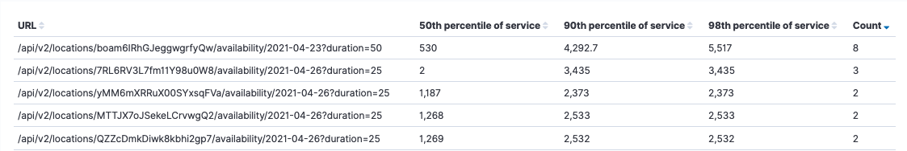

I'm sure you now know how to add it to a dashboard 🙌


### Detail data: Identifying HTTP error URLs

Add a new visualization, again of type Data Table and again with "HTTP requests" data source. Let's call it "HTTP errors"

Let's split the rows by its url as we did before, by adding a "Split rows" bucket, but this time ordering them by Count

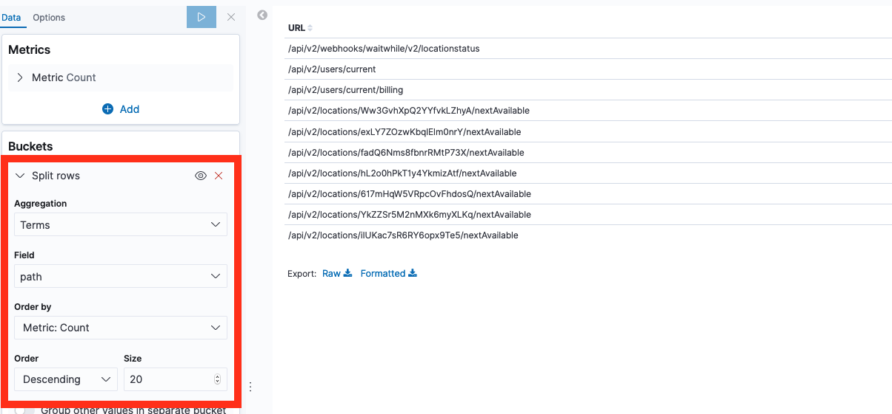

Again, we got a table showing us the most requested urls.


Now lets filter away any status < 400.


This shows us which URLs got the most "bad" responses. You can add this to a new debugging dashboard as is, and create separate lists for specific statuses.

Alternatively, you can add columns for the statuses such as 400, 404 and 500. Lets see how:

Add a new metric of aggregation "Sum bucket". Use aggregation "Filters", with filter 1 being "status:404". In custom label at the bottom, write "404".

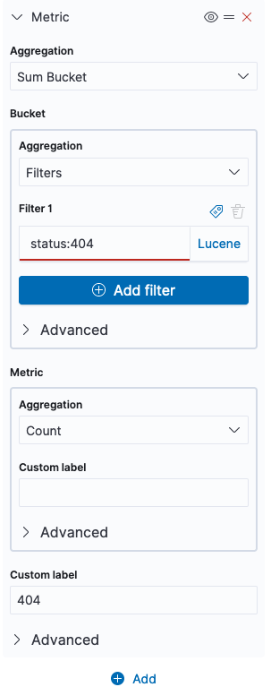

_Repeat the process for the different statuses you care about to add more columns._

Tada! 🎉 You now got a list of URLs that responds with bad status codes, and their amount. You can click on each header column to sort by e.g. most 500 erros, most 404 errors etc.

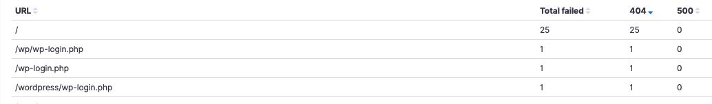

_As we see in my example, there seems to be a bot trying to log in to my non-existing Wordpress. And my app has 0 visitors – what's new 🙊_

## Related links

- [logz.io academy](https://logz.io/learn/training/)
- [logz.io docs](https://docs.logz.io/)
